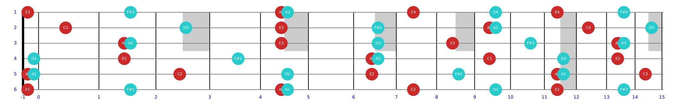
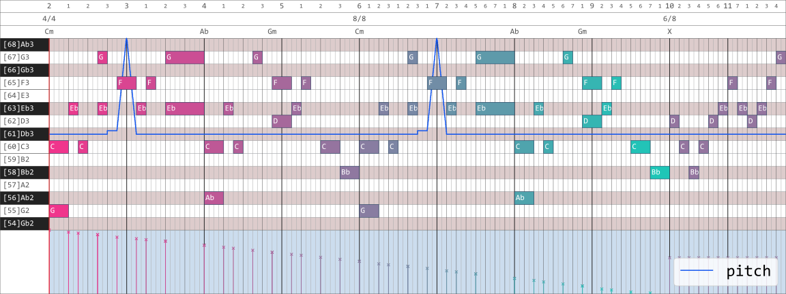
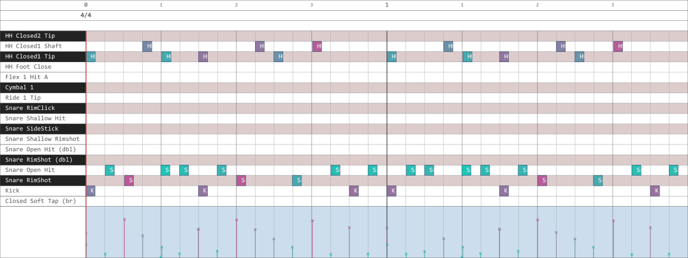

---

## How to use this tool

#### 设计思路

基于 `triple`，`triple` 定义为表示了音符的 $[\text{音高编号}(0, 12)，\text{升降记号}(-\infty, +\infty)，\text{音组序号}(-1, +\infty)]$ 的三元数组。后续所有和弦、音阶等内容的表示都建立在 `triple` 之上。

`consts.py` 包含了按照乐理定义的各种常量

`utils.py` 包含了常用的各种函数

#### 已有函数

* 用于解析音名、和弦名和调性名称的正则表达式
* 常用转换函数
* 音乐理论函数
* 绘图函数
* 乐器建模

