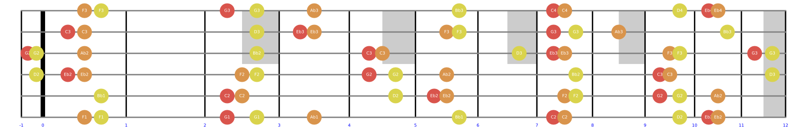
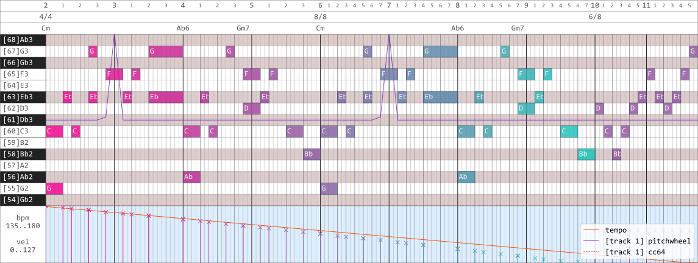

# diatonic tools: 音乐分析与可视化

## 0 综述

### 0.1 依赖

`mido`, `matplotlib` 是两个必备的库。

不少核心功能是直接使用 Python 的列表实现的。

此外，`numpy` 也是必要的（方便表示吉他指板）。

### 0.2 结构

`audio.py` 包含了一些和**音频生成**以及**频谱分析**有关的东西

`consts.py` 包含了无法从逻辑计算中得到的常量，如和弦种类名称

`instruments.py` 包含了对乐器进行建模的类，如 `Guitar`

`midi.py` 通过 `mido` 实现了一系列 MIDI 显示与写入功能

`theories.py` 包含了理论分析常用的各种函数和类

### 0.3 思路

很多音乐软件都没有对音乐理论进行建模（这里面最重要的是基本音级与升降记号的使用）。

### 0.4 符号

#### 0.4.1 `audio.py`

#### 0.4.2 `consts.py`

#### 0.4.3 `instruments.py`

#### 0.4.4 `midi.py`

#### 0.4.5 `theories.py`

### 0.5 注意

`note` 这个变量名有时候表示 `theories.py` 中的类 `Note` 的实例，有时候表示 MIDI 音高编号（整数），有时候表示 `midi.py` 中的一个 MIDI message，需要根据上下文来进行区分。此外，`midi.py` 中 `note` 表示的 MIDI message 是个字典，键 `‘note’` 对应的值是 MIDI 音高编号。

`step` 这个变量名指的是音级，它是和具体的音阶有关系的。在自然音级组成的大调音阶中，`note` 为 {0, 2, 4, 5, 7, 9, 11} 时对应的 `step` 是 {0, 1, 2, 3, 4, 5, 6}。全音阶中，`note` 为 {0, 2, 4, 6, 8, 10} 时对应的 `step` 是 {0, 1, 2, 3, 4, 5}，依此类推。

`interval` 变量名有时候指的是两个作为音高编号的 `note` 的差，有时候指的是两个作为类 `Note` 的实例 `note` 的差，和 `note` 这个变量名一样，需要根据上下文来进行区分。

变量名/字典键中带有 `name`，`type` 等字样的一般是字符串，用于 `consts.py` 中的字典的索引，或面向用户时的显示文本。

变量名/字典键中带有 `_str` 后缀的一般也是字符串，它往往可以直接通过 `eval()` 或其他什么方法来获得**数值**。

## 1 进度

这是 `midi.py` 的开发进度汇总表格，其中 `Pianoroll` 类占据了主导地位。

|                         功能                          | 进度 | 备注 |
| :---------------------------------------------------: | :--: | :--: |
|                   选择一个漂亮字体                    |  ✅   |      |
|           某一个 channel 下 pitchwheel 显示           |  ✅   |      |
| 某一个 channel 下 cc 按照已使用的控制器编号分色彩显示 |  ✅   |      |
|     pitchwheel/cc 曲线两端没有值时自动使用默认值      |  ✅   |      |
|      pitchwheel/cc 曲线延伸到显示区间外面怎么办       |  ✅   |      |
|           velocity shader / channel shader            |  ✅   |      |
|         根据给定图形尺寸自动设定钢琴键盘宽度          |      |      |
|         根据四分音符的长宽比自动设定图形尺寸          |  ✅   |      |
|                     变化 bpm 显示                     |  ✅   |      |
|                   恒定速率 bpm 显示                   |  ✅   |      |
|                  time signature 显示                  |  ✅   |      |
|                    拍子线刻度显示                     |  ✅   |      |
|                    HMS 时间轴显示                     |      |      |
|              chord 显示（需要人工添加）               |  ✅   |      |
|               歌词显示（需要人工添加）                |  ✅   |      |
|                 全局 xy 显示区间估计                  |  ✅   |      |
|               选定水平区间内高度自适应                |  ✅   |      |
|                   钢琴卷帘显示鼓谱                    |  ✅   |      |
|                    文字的 clip box                    |  ✅   |      |
|                       多轨显示                        |  ✅   |      |
|         重构 pianoroll 类，使用更加一般的方法         |  ✅   |      |
|          可自由添加/删去的 top/bottom lanes           |      |      |
|                       高层 API                        |      |      |
|                      main 函数壳                      |      |      |
|                     样式表的使用                      |      |      |
|                 off velocity 向下显示                 |      |      |
|                鼓谱的菱形 marker 显示                 |      |      |
|             面向用户的 tick_interval 设置             |      |      |
|            多个 track 同时显示时的 legend             |      |      |
|           钢琴卷帘显示 ample 吉他和贝司键位           |      |      |
|                  解决 channel 的问题                  |      |      |
|               使用多个 axes 拆分钢琴窗                |      |      |
|            写 sheet 到 midi 转换的接口函数            |      |      |
|          生成随机 tempo 摆动，写回 midi 文件          |      |      |
|           生成 sierpinski 三角形 midi 序列            |      |      |

## 2 `audio.py` 文档

## 3 `consts.py` 文档

## 4 `instruments.py` 文档

## 5 `midi.py` 文档

### 5.1 函数

#### 5.1.1 matplotlib 用函数

---

##### `get_figure(w, h, dpi)`

说明：

用于初始化一幅图像，使 `Axes` 撑满整个 `Figure`，关闭 `Axes` 的轴显示，并使 `Axes` 内部的 `margins` 为 0。

参数：

`w`：输出图像的宽度。

`h`：输出图像的高度。

`dpi`：输出图像的分辨率。

返回：

`matplotlib.axes.Axes`：一个 matplotlib 的坐标系。

---

##### `rgb_shader(t, t_min=0, t_max=127, color1=(0.94, 0.02, 0.55), color2=(0.11, 0.78, 0.72))`

说明：

创建两个 RGB 颜色空间上的颜色的线性渐变，并取出其间某一点的颜色值。

参数：

`t`：颜色在渐变中所处的位置。

`t_min`：渐变左端位置。

`t_max`：渐变右端位置。

`color1`：渐变左端颜色（RGB）。

`color2`：渐变右端颜色（RGB）。

返回：

`list`：表示 RGB 颜色的三元组列表。

---

##### `hsv_shader(t, t_min=0, t_max=15, color1=(0.00, 0.80, 0.75), color2=(1.00, 0.80, 0.75))`

说明：

创建两个 HSV 颜色空间上的颜色的线性渐变，并取出其间某一点的颜色值。

参数：

`t`：颜色在渐变中所处的位置。

`t_min`：渐变左端位置。

`t_max`：渐变右端位置。

`color1`：渐变左端颜色（HSV）。

`color2`：渐变右端颜色（HSV）。

返回：

`list`：表示 RGB 颜色的三元组列表。

---

##### `const_shader(t, t_min=0, t_max=1, color=(1.0, 0.0, 0.0))`

说明：

创建一个 RGB 颜色空间上的常值渐变。

`t`：颜色在渐变中所处的位置。

`t_min`：任意。

`t_max`：任意。

`color`：常值颜色（RGB），取值

返回：

`list`：表示 RGB 颜色的三元组列表，等于 `color`。

#### 5.1.2 midi/sheet 转换器

##### `track2msglist(track)`

说明：

把 `mido` 解析出的 MIDI 文件中的使用 delta time 的轨道（`track`）转换为使用 absolute time 的字典列表 `msglist`。

参数：

`track`：`mido.MidiFile.tracks[k]`

返回：

`msglist`：和 `track` 的内容相同，但 delta time 转换为了 absolute time，并且 `'type' == 'note_on'` 和 `'type' == 'note_off'` 两种 message 合并为了一个 `'type' == 'note'` 的 message，它包含键值 `type`, `time1`, `time2`, `note`, `velocity_on`, `velocity_off` 和 `channel`。 

---

##### `midi2sheet(filename)`

---

### 5.2 类

## 5 `theories.py` 文档

