# diatonic-tools： 使用 Python 进行 Diatonic 音乐理论分析与绘图

## 0.1  综述

这个名叫 diatonic-tools 的小型音乐理论分析框架给出了研究**任意平均律**下的 diatonic 音阶所需要的一系列基本工具。

在下文中（同样也是代码中），我们将设平均律的音数为 `N`，生成步长（半音数目）为 `G`，起始音为 `S`。在这套 `NGS` 配置下，可以得到音集 [`S%N`, `(S+G)%N`, `(S+2*G)%N`, ...]。对这个音集的音的音高（也就是这些整数的大小）进行排序，则得到广义的 Diatonic 音阶。

若 `G` 与 `N` 互质，则上述生成方式不断进行下去必将遍历全部的 `N` 个音。进一步，额外要求生成到 `(S+M*G)%N = (S+1)%N` 即停止，则我们只需要 `M` 个音外加升降号即可表示全部的 `N` 个音（`S+1` 就可以表示为 `S#`）。`M` 满足 `M*G` 和 1 模 `N` 同余，因此 `M` 可以通过求 `G` 的模逆元得到。在代码中定义为 `M = pow(G, -1, N)`。这 `M` 个音经过重新排列后得到狭义的 Diatonic 音阶。若没有额外说明，下文所称 Diatonic 音阶均指狭义 Diatonic 音阶。

当 `[N, G, S] = [12, 7, 5]` 时，对应的 Diatonic 音阶为 [0, 2, 4, 5, 7, 9, 11]。把这些音命名为 [C, D, E, F, G, A, B]，就可以和传统 12 平均律音乐理论保持一致。

当 `[N, G, S] = [19, 11, 8]` 时，对应的 Diatonic 音阶为 [0, 3, 6, 8, 11, 14, 17]，把这些音同样命名为 [C, D, E, F, G, A, B]，就得到了 19 平均律下 Diatonic 音阶的一种经典表示。

当 `[N, G, S]` 任意（`N`, `G` 互质）时，需要先通过 `pow(G, -1, N)` 算出音数 `M`，然后人工指定 `M` 个符号作为这些音的音名。在代码中这 `M` 个符号以字符串记录，为 `NAMED_STR_LIN`，也就是在单周期内音高从小到大线性排列时各音的名称。对于上述 12 平均律和 19 平均律两例，`NAMED_STR_LIN = 'CDEFGAB'`。

12 平均律下传统的调性，和声等概念的基础就是 Diatonic 音阶，其他各种复杂的音阶与和弦说到底可以用加入了一些变化的 Diatonic 音阶来表示，这里称为 Altered Diatonic 音阶。例如，[C, D, E, F, G, A, B]（C Ionian）是 Diatonic 音阶，[C, D, E, F#, G, A, B]（C Lydian）是 Diatonic 音阶，而 [C, D, Eb, F, G, A, B]（C Ionian(b3) 或 C Melodic Minor）则是 Altered Diatonic 音阶。又如：[C, E, G, F#] 是 Diatonic 和弦，因为它是 C Lydian 的一部分；而 [C, Eb, G, B] 却是 Altered Diatonic 和弦，因为它**不是**任何 Diatonic 音阶的一部分。注意：Altered Diatonic 音阶也可能产生 Diatonic 和弦！

## 0.2  diatonic-tools 框架结构

* `consts.py` 是最基础的文件，里面定义了各种常数（如上文提到的 `N`, `G`, `S`, `M` 等）、名称、色彩方案以及常用函数
* `theories.py` 是 diatonic-tools 的核心，音乐理论对象的实现，包括了 `Note` 类、`Interval` 类、`DiatonicScale` 类、`AlteredDiatonicScale` 类、`Chord` 类和 `ChordScale` 类。这些类之间有相互运算、调用或继承的关系。一些主要的关系：
  * `Note` 和 `Note` 做减法得到 `Interval`
  * `Note` 和 `Interval` 做加法得到 `Interval`
  * `Interval` 和 `Interval` 做加减法得到 `Interval`
  * `Interval` 和 `Note` 做加法得到 `Note`
  * `DiatonicScale` 核心是 `Note` 的实例组成的列表
  * `AlteredDiatonicScale` 是 `DiatonicScale` 的子类
  * `Chord` 核心同样是 `Note` 的实例组成的列表
  * `ChordScale` 是 `AlteredDiatonicScale` 的子类
* `instruments.py` 使用 `theories.py` 中定义的音乐理论对象实现了一些图形的绘制功能。目前可绘制的图形包括：
  * `Guitar`：吉他指板示意图（支持任意弦数，任意品数，任意调弦，可绘制完整的指板图或和弦的指法图）
  * `Piano`：钢琴键盘示意图（可绘制任意平均律键盘图形，并在上面显示音符）
  * `Clock`：钟表指针图（支持任意等分圆周，并在上面以指针的形式显示音符）
  * `ColorScheme`：从音高生成配色方案（把排列在圆周上的音符映射到色环）
  * `GenLine`：在生成序列上显示音符（在 `[N, G] = [12, 7]` 时生成序列就是排列成纯五度的音符）
  * `Tonnetz`：在调性网格上显示音符（目前只支持 12 平均律和 19 平均律，可以显示中心轴系统的着色）
* 其他的文件尚未完成，暂时略过

## 1.1  使用 `theories.py`

### 1.1.1 使用 `Note` 类

### 1.1.2 使用 `Interval` 类

### 1.1.3 使用 `DiatonicScale` 类

### 1.1.4 使用 `AlteredDiatonicScale` 类

### 1.1.5 使用 `Chord` 类

### 1.1.6 使用 `ChordScale` 类

## 1.2 使用 `instruments.py`

### 1.2.1 使用 `Guitar` 类

### 1.2.2 使用 `Piano` 类

### 1.2.3 使用 `Clock` 类

### 1.2.4 使用 `ColorScheme` 类

### 1.2.5 使用 `GenLine` 类

### 1.2.6 使用 `Tonnetz` 类

