# diatonic-tools：<br>使用 Python 进行 Diatonic 音乐理论分析与绘图

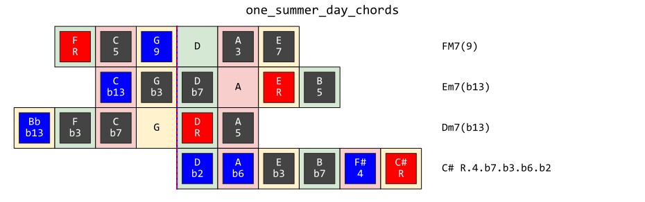

## 0.1  综述

这个名叫 diatonic-tools 的小型音乐理论分析框架给出了研究**任意平均律**下的 Diatonic 音阶所需要的一系列基本工具。

在下文中（同样也是代码中），我们将设平均律的音数为 `N`，生成步长（半音数目）为 `G`，起始音为 `S`。在这套 `NGS` 配置下，可以得到音集 [`S % N`, `(S + G) % N`, `(S + 2 * G) % N`, `...`]。对这个音集的音的音高（也就是这些整数的大小）进行排序，则得到**广义的 Diatonic 音阶**。

若 `G` 与 `N` 互质，则上述生成方式不断进行下去必将遍历全部的 `N` 个音。进一步，额外要求生成到 `(S + M * G) % N = (S + 1) % N` 即停止，则我们只需要 `M` 个音外加升降号即可表示全部的 `N` 个音（`S+1` 就可以表示为 `S#`）。`M` 满足 `M * G` 和 1 模 `N` 同余，因此 `M` 可以通过求 `G` 的模逆元得到。在代码中定义为 `M = pow(G, -1, N)`。这 `M` 个音经过重新排列后得到狭义的 Diatonic 音阶。若没有额外说明，下文所称 Diatonic 音阶均指**狭义 Diatonic 音阶**。

在某一套 `NGS` 配置下，在一个周期内从小到大进行排列的狭义 Diatonic 音阶叫做**自然音阶**。

当 `[N, G, S] = [12, 7, 5]` 时，对应的自然音阶为 `[0, 2, 4, 5, 7, 9, 11]`。把这些音命名为 `[C, D, E, F, G, A, B]`，就可以和传统 12 平均律音乐理论保持一致。注意：传统乐理中自然音阶可以从任意一个音级开始。本程序要求自然音阶必须是从一个周期内最小的音开始的音阶。

当 `[N, G, S] = [19, 11, 8]` 时，对应的自然音阶为 `[0, 3, 6, 8, 11, 14, 17]`，把这些音同样命名为 `[C, D, E, F, G, A, B]`，就得到了扩展至 19 平均律的自然音阶。

当 `[N, G, S]` 任意（`N`, `G` 互质）时，需要先通过 `pow(G, -1, N)` 算出音数 `M`，然后人工指定 `M` 个符号作为这些音的音名。在代码中这 `M` 个符号以字符串记录，为 `NAMED_STR_LIN`，也就是在单周期内音高从小到大线性排列时各音的名称。对于上述 12 平均律和 19 平均律两例，`M = 7`，`NAMED_STR_LIN = 'CDEFGAB'`。

12 平均律下传统的调性，和声等概念的基础就是 Diatonic 音阶，其他各种复杂的音阶与和弦说到底可以用加入了一些变化的 Diatonic 音阶来表示，这里称为 Altered Diatonic 音阶。例如，`[C, D, E, F, G, A, B]`（C Ionian）是 Diatonic 音阶，`[C, D, E, F#, G, A, B]`（C Lydian）是 Diatonic 音阶，而 `[C, D, Eb, F, G, A, B]`（C Ionian(b3) 或 C Melodic Minor）则是 Altered Diatonic 音阶。又如：`[C, E, G, F#]` 是 Diatonic 和弦，因为它是 C Lydian 的一部分；而 `[C, Eb, G, B]` 却是 Altered Diatonic 和弦，因为它**不是**任何 Diatonic 音阶的一部分。注意：Altered Diatonic 音阶也可能产生 Diatonic 和弦！

## 0.2  diatonic-tools 框架结构



* `consts.py` 是最基础的文件，定义了各种常数（如 `N`, `G`, `S`, `M` 等）、常用函数、名称、色彩方案等
* `theories.py` 是 diatonic-tools 的核心，音乐理论对象的实现，包括了 `Note` 类、`Interval` 类、`DiatonicScale` 类、`AlteredDiatonicScale` 类、`Chord` 类和 `ChordScale` 类。这些类之间有相互运算、调用或继承的关系。一些主要的关系：
  * `Note` 和 `Note` 做减法得到 `Interval`
  * `Note` 和 `Interval` 做加法得到 `Interval`
  * `Interval` 和 `Interval` 做加减法得到 `Interval`
  * `Interval` 和 `Note` 做加法得到 `Note`
  * `DiatonicScale` 核心是 `Note` 的实例组成的列表
  * `AlteredDiatonicScale` 是 `DiatonicScale` 的子类
  * `Chord` 核心同样是 `Note` 的实例组成的列表
  * `ChordScale` 是 `AlteredDiatonicScale` 的子类
* `instruments.py` 使用 `theories.py` 中定义的音乐理论对象实现了一些图形的绘制功能。目前可绘制的图形包括：
  * `Guitar`：吉他指板示意图（支持任意弦数，任意品数，任意调弦，可绘制完整的指板图或和弦的指法图）
  * `Piano`：钢琴键盘示意图（可绘制任意平均律键盘图形，并在上面显示音符）
  * `Clock`：钟表指针图（支持任意等分圆周，并在上面以指针的形式显示音符）
  * `ColorScheme`：从音高生成配色方案（把排列在圆周上的音符映射到色环）
  * `GenLine`：在生成序列上显示音符（在 `[N, G] = [12, 7]` 时生成序列就是排列成纯五度的音符）
  * `Tonnetz`：在调性网格上显示音符（目前只支持 12 平均律和 19 平均律，可以显示中心轴系统的着色）
* 其他的文件尚未完成，暂时略过

## 1.1  使用 `theories.py`

### 1.1.0 导入 `theories.py`

```python
>>> from theories import *
----------------------------------------------
12-TET | 7-tone | step length: 7 | starting: 5
named notes: 0=C 2=D 4=E 5=F 7=G 9=A 11=B 
----------------------------------------------
```

### 1.1.1 使用 `Note` 类

`Note` 是使用三元数组进行表示的音符类。(`named_nnrel`, `accidental`, `register`) 这个三元数组可以唯一确定一个音符。

* 第一个参数 `named_nnrel` 表示**不带升降号的音名**对应的数字编号（模 `N` 取余）
* 第二个参数 `accidental` 表示升降号数目，取值为负无穷到正无穷的整数
* 第三个参数 `register` 表示音区，取值为负无穷到正无穷的整数

`Note` 的绝对音高编号可以由公式 `named_nnrel` + `accidental` + `N` * `register` 获得。

**Example. 1** 使用名称创建音符

```python
>>> Note('C')
Note('C0')
```

**Example. 2** 使用三元数组创建音符

```python
>>> Note().set_vector(named_nnrel=2, accidental=1, register=1)
Note('D#1')
```

**Example. 3** 获取音符名称

```python
>>> Note('Eb2').get_name()
'Eb2'
>>> Note('Eb2').get_name(show_register=False)
'Eb'
>>> str(Note('Eb2'))
'Eb2'
```

**Example. 4**  获取音符三元数组

```python
>>> Note('F#3').get_vector()
(5, 1, 3)
>>> Note('F#3').get_named_nnrel()
5
>>> Note('F#3').get_accidental()
1
>>> Note('F#3').get_register()
3
```

**Example. 5** 获取音符绝对音高编号

```python
>>> int(Note('Gb4'))  # 7 - 1 + 4 * 12
54
```

**Example. 6** 获取音符相对音高编号（有可能得到区间 [0, 12) 以外的整数）

```python
>>> Note('Gb4').get_nnrel()  # 7 - 1
6
```

**Example. 7** 为音符添加升降号

```python
>>> Note('Ab5').add_accidental(2)
Note('A#5')
```

**Example. 8** 改变音符的音区

```python
>>> Note('B1').add_register(-1)
Note('B0')
```

**Example. 9** 获取等音符（默认参数 `direction='auto'` 下，自动沿着减少升降号的方向求等音符）

```python
>>> Note('Bb1').get_enharmonic_note(direction='auto')
Note('A#1')
>>> Note('A#1').get_enharmonic_note(direction='auto')
Note('Bb1')
>>> Note('Cbbb1').get_enharmonic_note(direction='auto')
Note('Bbb0')
>>> Note('C1').get_enharmonic_note(direction='auto')
Note('C1')
>>> Note('C1').get_enharmonic_note(direction='up')
Note('Dbb1')
>>> Note('C1').get_enharmonic_note(direction='down')
Note('B#0')
```

**Example. 10** 音符大小比较

```python
>>> Note('C1') > Note('C0')  # 12 > 0 -> True
True
>>> Note('C1') > Note('B#0')  # 12 > 12 -> False（C1 和 B#0 绝对音高编号相同）
False
>>> Note('C1') == Note('B#0')  # 'C1' == 'B#0' -> False（虽然音高相同但不是同一个音符）
False
>>> Note('C1') < 13  # 12 < 13 -> True
True
>>> Note('C1') == 12  # 12 == 12 -> True
True
>>> Note('C1') == 'C1'  # 'C1' == 'C1' -> True
True
```

**Example. 11** 为音符添加额外信息；获取音符额外信息（通信用）

```python
>>> note = Note('C1')
>>> note.set_message(test='this is additional message')
Note('C1')
>>> note.get_message('test')
'this is additional message'
```

### 1.1.2 使用 `Interval` 类

`Interval` 是使用二元数组进行表示的音程类。(`delta_nnabs`, `delta_step`) 这个二元数组可以唯一确定一个音程。

* 第一个参数 `delta_nnabs` 表示两音绝对音高编号的差
* 第二个参数 `delta_step` 表示两音在自然音阶中的级数差

**Example. 1** 使用名称创建音程

```python
>>> Interval('M2')
Interval('M2')
```

**Example. 2** 使用二元数组创建音程

```python
>>> Interval().set_vector(12, 7)
Interval('P8')
```

**Example. 3** 获取音程名称

```python
>>> Interval('M3').get_name()
'M3'
>>> str(Interval('M3'))
'M3'
```

**Example. 4** 获取音程二元数组

```python
>>> Interval('m3').get_vector()
(3, 2)
>>> Interval('m3').get_delta_nnabs()
3
>>> Interval('m3').get_delta_step()
2
>>> int(Interval('m3'))  # 等同于 Interval('m3').get_delta_nnabs()
3
```

**Example. 5** 获取 r357t 表示（把当前音程和自然音阶中的音程进行比较）

```python
>>> Interval('d2').get_r357t()  # 自然音阶中的二度是大二度
'bb2'
>>> Interval('m3').get_r357t()  # 自然音阶中的三度是大三度
'b3'
>>> Interval('P4').get_r357t()  # 自然音阶中的四度是纯四度
'4'
>>> Interval('M6').get_r357t()  # 自然音阶中的六度是大六度
'6'
>>> Interval('A7').get_r357t()  # 自然音阶中的七度是大七度
'#7'
```

**Example. 6** 从 r357t 表示创建音程

```python
>>> Interval().from_r357t('b2')
Interval('m2')
```

**Example. 7** 音程归一化

```python
>>> Interval('M9').normalize()
Interval('M2')
>>> Interval('-m3').normalize()
Interval('M6')
```

**Example. 8** 音程大小比较

```python
>>> Interval('M3') > Interval('m3')  # 4 > 3 -> True
True
>>> Interval('m3') > Interval('A2')  # 3 > 3 -> False
False
>>> Interval('m3') == Interval('A2')  # 'm3' == 'A2' -> False
False
>>> Interval('m3') == 3  # 3 == 3 -> True
True
>>> Interval('A2') == 3  # 3 == 3 -> True
True
>>> Interval('m3') == 'A2'  # 'm3' == 'A2' -> False
False
```

### 1.1.3 `Note` 类和 `Interval` 类的交互

**Example. 1** `Note` - `Note` -> `Interval`

```python
>>> Note('D2') - Note('C1')
Interval('M9')
>>> Note('C1') - Note('E1')
Interval('-M3')
```

**Example. 2** `Note` + `Interval` -> `Interval` / `Interval` + `Note` -> `Note`

```python
>>> Note('D2') + Interval('M3')
Note('F#2')
>>> Interval('M3') + Note('D2')
Note('F#2')
>>> Note('B2') + Interval('-m2')
Note('A#2')
>>> Interval('-m2') + Note('B2')
Note('A#2')
```

**Example. 3** `Interval` ± `Interval` -> `Interval`

```python
>>> Interval('M3') + Interval('m3')
Interval('P5')
>>> Interval('P8') - Interval('m3')
Interval('M6')
```

**Example. 4** `Interval` * `int` -> `Interval` / `int` * `Interval` -> `Interval`

```python
>>> Interval('P5') * 2
Interval('M9')
>>> (Interval('P5') * 5).normalize()
Interval('M7')
```

**Example. 5** 负音程与音程绝对值

```python
>>> -Interval('M3')
Interval('-M3')
>>> (-Interval('M3')).normalize()
Interval('m6')
>>> abs(-Interval('M3'))
Interval('M3')
```

### 1.1.4 使用 `DiatonicScale` 类

`DiatonicScale` 类使用一个 `Note` 实例组成的列表表示 Diatonic 音阶。目前仅支持从名称创建。名称有两种命名方案（Naming Scheme, NS），`ns=0` 时采用最通用的命名方式，如 C C-mode，C E-mode 等。`ns=1` 时采用传统的命名方式，如 C Ionian，C Phrygian 等。

**Example. 1** 使用名称创建 Diatonic 音阶

```python
>>> print(DiatonicScale('C C-mode'))  # ns=0
[C, D, E, F, G, A, B]
>>> print(DiatonicScale('C Phrygian'))  # ns=1
[C, Db, Eb, F, G, Ab, Bb]
```

**Example. 2** 获取 Diatonic 音阶名称

```python
>>> DiatonicScale('C D-mode').get_name()
'C D-mode'
>>> DiatonicScale('C Dorian').get_name()
'C D-mode'
>>> DiatonicScale('C D-mode').set_printoptions(ns=1).get_name()
'C Dorian'
>>> DiatonicScale('C D-mode').set_printoptions(ns=1).get_name(type_only=True)
'Dorian'
```

**Example. 3** 获取 Diatonic 音阶中的音符

```python
>>> DiatonicScale('C Phrygian')[:3]
[Note('C0'), Note('Db0'), Note('Eb0')]
```

**Example. 4** 获取 Diatonic 音阶中音符属性列表

```python
>>> DiatonicScale('C Phrygian').get_named_nnrel_list()
[0, 2, 4, 5, 7, 9, 11]
>>> DiatonicScale('C Phrygian').get_nnrel_list()
[0, 1, 3, 5, 7, 8, 10]
>>> DiatonicScale('C Phrygian').get_accidental_list()
[0, -1, -1, 0, 0, -1, -1]
>>> DiatonicScale('C Phrygian').get_register_list()
[0, 0, 0, 0, 0, 0, 0]
>>> DiatonicScale('C Phrygian').get_nnabs_list()
[0, 1, 3, 5, 7, 8, 10]
```

**Example. 5** 改变调式主音（可以从音名设定，也可以从度数设定）

```python
>>> DiatonicScale('C Ionian').set_scale_tonic_str(scale_tonic_name='D')
DiatonicScale('D D-mode')
>>> DiatonicScale('C Ionian').set_scale_tonic_deg(degree=2)
DiatonicScale('E E-mode')
```

**Example. 6** 改变调号（按照生成序列顺序添加升降号）

```python
>>> DiatonicScale('C Ionian').add_accidental(1).set_printoptions(ns=1)
DiatonicScale('C Lydian')
>>> DiatonicScale('C Ionian').add_accidental(-2).set_printoptions(ns=1)
DiatonicScale('C Dorian')
>>> DiatonicScale('C Ionian').add_accidentals_for_all(1)
DiatonicScale('C# C-mode')
```

**Example. 7** 从 Diatonic 音阶生成和弦

```python
>>> DiatonicScale('C Ionian').get_chord(root_degree=0, n_notes=4)
[Note('C0'), Note('E0'), Note('G0'), Note('B0')]
>>> DiatonicScale('C Ionian').get_chord_ex(degrees=(0, 3, 4, 6))
[Note('C0'), Note('F0'), Note('G0'), Note('B0')]
```

### 1.1.5 使用 `AlteredDiatonicScale` 类

`AlteredDiatonicScale` 类是 `DiatonicScale` 类的子类，基本继承了 `DiatonicScale` 类的所有方法。目前仅支持从名称创建。名称有三种命名方案，`ns=0` 时采用最通用的命名方式，如 C C-mode(#5)，C E-mode(#3) 等。`ns=1` 时采用传统的命名方式，如 C Ionian(#5)，C Phrygian(#3) 等。`ns=2` 时采用习惯的命名方式，如 C Ionian Augmented，C Phrygian Dominant 等。

`AlteredDiatonicScale` 额外具有 `distance` 和 `get_order` 两个方法。前者给出到另一个 `DiatonicScale` 或 `AlteredDiatonicScale` 的**结构距离**，后者给出到 Diatonic 音阶的结构距离（定义为阶数）。音阶 A 到音阶 B 的结构距离指的是音阶 A 的结构和音阶 B 的结构相差的最少半音变化次数。比如说，Aeolian(#6, #7) 是旋律小调音阶，它到 Diatonic 音阶的结构距离是 1，因为 Aeolian(#6, #7) 等价于 Ionian(b3)。结构距离和主音无关。

获取 Altered Diatonic 音阶的名称的方法 `get_name()` 也被重写了，因为一个 Altered Diatonic 音阶可能具有**多个名称**。比如旋律大小调类音阶，各调式均有 2 种名称（Lydian(b7) = Mixolydian(#4)，等）。注意：在获取 Mixolydian(b9, b13) 音阶的名称时，它会自动转换为 Phrygian(#3)，因为获取的名称必须包含最少的变化音数目。在这一点上，可能会和 Jazz 理论有一些出入。

**Example. 1** 使用名称创建 Altered Diatonic 音阶

```python
>>> print(AlteredDiatonicScale('C C-mode(b5)'))  # ns=0
[C, D, E, F, Gb, A, B]
>>> print(AlteredDiatonicScale('C Phrygian(#3)'))  # ns=1
[C, Db, E, F, G, Ab, Bb]
>>> print(AlteredDiatonicScale('C Phrygian Dominant'))  # ns=2
 [C, Db, E, F, G, Ab, Bb]
```

**Example. 2** 获取 Altered Diatonic 音阶名称

```python
>>> AlteredDiatonicScale('C Lydian(b7)').get_name()
['C G-mode(#4)', 'C F-mode(b7)']
>>> AlteredDiatonicScale('C Phrygian(#6, #7)').get_name()
['C C-mode(b2, b3)', 'C E-mode(#6, #7)', 'C D-mode(b2, #7)']
```

**Example. 3** 求两个 Altered Diatonic 音阶之间的结构距离

```python
>>> ads1 = AlteredDiatonicScale('C Lydian(b7)')
>>> ads2 = AlteredDiatonicScale('C Ionian(#5)')
>>> ads1.distance(ads2)
1
```

**Example. 4** 求 Altered Diatonic 音阶的阶数

```python
>>> ads = AlteredDiatonicScale('C Ionian(b2, #4, #5, #6)')  # Enigmatic Scale
>>> ads.get_name()
['C F-mode(b2, #5, #6)', 'C E#-mode(b1, b2, #6)', 'C D#-mode(b1, bb2)']
>>> ads.get_order()
3
```

### 1.1.6 使用 `Chord` 类

`Chord` 类使用三个 `Note` 实例组成的列表表示一个和弦。`self._bass` 储存了和弦低音，`self._body` 储存了和弦的基本音，`self._tension` 储存了和弦的张力音。名称有两种命名方案，`ns=0` 时采用最通用的命名方式，如 C R.3.5.7，C R.b3.5.b7 等。`ns=1` 时采用传统的命名方式，如 CM7，Cm7 等。

**Example. 1** 使用名称创建和弦

```python
>>> print(Chord('C R.3.5.7'))  # ns=0
bass: []
body: [C, E, G, B]
tension: []
>>> print(Chord('FM7(#11)/C'))  # ns=1
bass: [C]
body: [F, A, C, E]
tension: [B]
```

**Example. 2** 获取和弦名称

```python
>>> Chord().set_notes(bass=[Note('F#')], body=[Note('C'), Note('E'), Note('G#')]).set_printoptions(ns=1).get_name()
'C+5/F#'
>>> Chord('C R.b3.5.b7(b9, 11, b13)').set_printoptions(ns=1).get_name()
'Cm7(b9, 11, b13)'
```

**Example. 3** 获取和弦中的音符

```python
>>> Chord('Cm7(b13)')[:]
[Note('C0'), Note('Eb0'), Note('G0'), Note('Bb0'), Note('Ab1')]
```

**Example. 4** 获取和弦的音程列表

```python
>>> Chord('Cm7(b13)').get_intervals_seq()
[Interval('m3'), Interval('M3'), Interval('m3'), Interval('m7')]
>>> Chord('Cm7(b13)').get_intervals_cum()
[Interval('P1'),
 Interval('m3'),
 Interval('P5'),
 Interval('m7'),
 Interval('m13')]
```

**Example. 5** 获取和弦所在的背景音阶

```python
>>> Chord('G 7').get_scale(max_order=1, ns=2)  # 'G7' is a major triad on G7, 'G 7' is dominant 7th on G0
['G Phrygian Dominant',
 'G HMP5b',
 'G Melodic Major',
 'G Aeolian Dominant',
 'G Mixolydian',
 'G Acoustic',
 'G Lydian Dominant',
 'G Mixolydian(#2)']
>>> Chord('Csus2/E').get_scale(max_order=2, ns=1)
['E Cb-mode(#1, b5)',
 'E Locrian(b4, b5)',
 'E Cb-mode(#1)',
 'E Locrian(b4)',
 'E Phrygian(b4)',
 'E Locrian',
 'E Phrygian',
 'E Phrygian(#4)',
 'E Cb-mode(#1, #2)',
 'E Locrian(#2, b4)',
 'E Aeolian(b4, b5)',
 'E Aeolian(b4)',
 'E Locrian(#2)',
 'E Aeolian(b5)',
 'E Aeolian',
 'E Aeolian(#4)']
```

### 1.1.7 使用 `ChordScale` 类（开发中）

`ChordScale` 类是 `AlteredDiatonicScale` 的一个封装，额外添加了鉴别 avoid note 的功能。avoid 种类被写在音符实例的 `_message` 词典中。目前 `ChordScale` 仅支持 `[N, G, S] = [12, 7, 5]`。目前支持的 avoid 种类：`'[CN]'` 为和弦音；`'[TN]'` 为可用张力音；`'[A0]'` 为 Mixolydian 的四度音，是 avoid note；`'[A2]'` 为 Dorian/Locrian 的大六度音，是 avoid note；`'[A1]'` 是和弦音上方小二度音，或 M7 音下方小二度音，是 avoid note；`'[OK]'` 是和弦音上方小二度音，但因为用在属和弦上，所以是破例允许使用的音。

**Example. 1** 显示 Altered Diatonic 音阶的 avoid note 种类

```python
>>> notes = ChordScale('C Dorian(b4)')
>>> for note in notes: print(note.get_message('avoid'))
[CN]
[TN]
[CN]
[A1]
[CN]
[A2]
[CN]
>>> notes = ChordScale('C Mixolydian(b2)')
>>> for note in notes: print(note.get_message('avoid'))
[CN]
[OK]
[CN]
[A0]
[CN]
[TN]
[CN]
```

### 1.1.8 一些具体的应用例子

**Example. 1** 打印同主音各调式顺阶和弦

```python
from theories import *

ds = DiatonicScale('F# Locrian').set_printoptions(ns=1)

for _ in range(7):
    ds.add_accidental(-1)
    print(ds.get_name(), end='\t')
    for deg in range(7):
        print(Chord().set_notes(body=ds.get_chord(deg, 4)).set_printoptions(ns=1).get_name(), end='\t')
    print()
```

输出：

```plain text
----------------------------------------------
12-TET | 7-tone | step length: 7 | starting: 5
named notes: 0=C 2=D 4=E 5=F 7=G 9=A 11=B 
----------------------------------------------
F Lydian	FM7	G7	Am7	Bm7-5	CM7	Dm7	Em7	
F Ionian	FM7	Gm7	Am7	BbM7	C7	Dm7	Em7-5	
F Mixolydian	F7	Gm7	Am7-5	BbM7	Cm7	Dm7	EbM7	
F Dorian	Fm7	Gm7	AbM7	Bb7	Cm7	Dm7-5	EbM7	
F Aeolian	Fm7	Gm7-5	AbM7	Bbm7	Cm7	DbM7	Eb7	
F Phrygian	Fm7	GbM7	Ab7	Bbm7	Cm7-5	DbM7	Ebm7	
F Locrian	Fm7-5	GbM7	Abm7	Bbm7	CbM7	Db7	Ebm7	
```

**Example. 2** 旋律倒影

```python
from theories import *

notes = DiatonicScale('C Ionian')[:]
mirror_note = Note('D')

intervals = [note - mirror_note for note in notes]
print(intervals)

notes_flipud = [mirror_note - itv for itv in intervals]
print(notes_flipud)
```

输出：

```python
----------------------------------------------
12-TET | 7-tone | step length: 7 | starting: 5
named notes: 0=C 2=D 4=E 5=F 7=G 9=A 11=B 
----------------------------------------------
[Interval('-M2'), Interval('P1'), Interval('M2'), Interval('m3'), Interval('P4'), Interval('P5'), Interval('M6')]
[Note('E0'), Note('D0'), Note('C0'), Note('B-1'), Note('A-1'), Note('G-1'), Note('F-1')]
```

**Example. 3** 求负和声

```python
from theories import *

major_tonic = Note('C0')
phrygian_p5_tonic = major_tonic + Interval('P5')  # Note('G0')

notes = Chord('G 7')[:]
intervals = [note - major_tonic for note in notes]

notes_neg = [phrygian_p5_tonic - itv for itv in reversed(intervals)]
print(Chord().set_notes(body=notes_neg).set_printoptions(ns=1).get_name())
```

输出：

```python
----------------------------------------------
12-TET | 7-tone | step length: 7 | starting: 5
named notes: 0=C 2=D 4=E 5=F 7=G 9=A 11=B 
----------------------------------------------
Dm7-5
```

**Example. 4** 生成 sUpEr UlTrA hYpEr MeGa MeTa LyDiAn 和弦 | youtube=https://www.youtube.com/watch?v=HeTygKpi6pI

```python
from itertools import cycle

intervals = [Interval('M2'), Interval('M2'), Interval('M2'), Interval('m2')]
intervals_cycle = cycle(intervals)

c = [Note('C')]
for _ in range(20):
    c.append(c[-1] + next(intervals_cycle))

print(c)
```

输出：

```python
[Note('C0'), Note('D0'), Note('E0'), Note('F#0'), Note('G0'), Note('A0'), Note('B0'), Note('C#1'), Note('D1'), Note('E1'), Note('F#1'), Note('G#1'), Note('A1'), Note('B1'), Note('C#2'), Note('D#2'), Note('E2'), Note('F#2'), Note('G#2'), Note('A#2'), Note('B2')]
```

## 1.2 使用 `instruments.py`

### 1.2.0 导入 `instruments.py`

```python
>>> from instruments import *
----------------------------------------------
12-TET | 7-tone | step length: 7 | starting: 5
named notes: 0=C 2=D 4=E 5=F 7=G 9=A 11=B 
----------------------------------------------
```

除了 `ColorScheme` 外，所有的类在 `plot` 方法下均可以设定参数 `color_style`。配色方案有 4 种选择：`'note'` 是按照音符进行着色；`'br357t'` 是按照音符在和弦中的位置进行着色（只适用于 `Chord` 输入）；`'degree'` 是按照音符在音阶中的位置进行着色（只适用于 `DiatonicScale`，`AlteredDiatonicScale` 以及 `ChordScale` 输入）；`'avoid'` 是按照 avoid note 种类进行着色（只适用于 `ChordScale` 输入）。

### 1.2.1 使用 `Guitar` 类

**Example. 1** 和弦完整指板图

```python
Guitar().set_notes(Chord('Caug/F#')).plot(title='Caug/F# (color_style=note)')
```

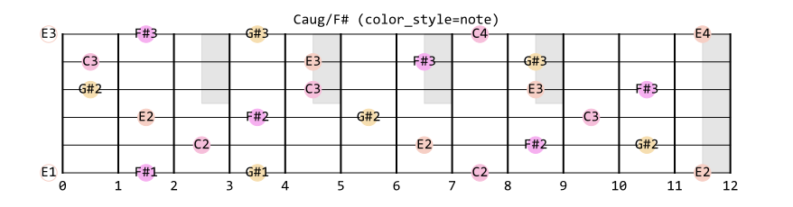

```python
Guitar().set_notes(Chord('Caug/F#')).plot(color_style='br357t', title='Caug/F# (color_style=br357t)')
```

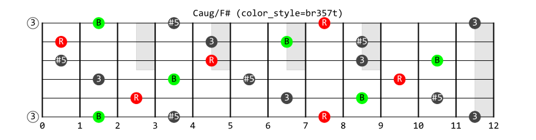

**Example. 2** 和弦指法图

```python
Guitar().set_notes(Chord('C')).plot(fret_left=0, fret_right=4, selection='x32010', color_style='br357t', title='C (color_style=br357t)')
```

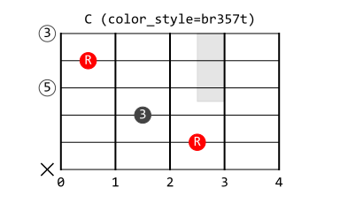

**Example. 3** 音阶完整指板图

```python
Guitar().set_notes(AlteredDiatonicScale('C Phrygian(#3)')).plot(color_style='degree', title='C Phrygian(#3) (color_style=degree)')
```

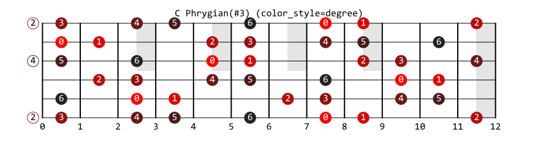

**Example. 4** 列举和弦全部指法

```python
Guitar().set_notes(Chord('Caug/F#')).plot_all_chords(color_style='br357t', title='Caug/F# (color_style=br357t)')
```

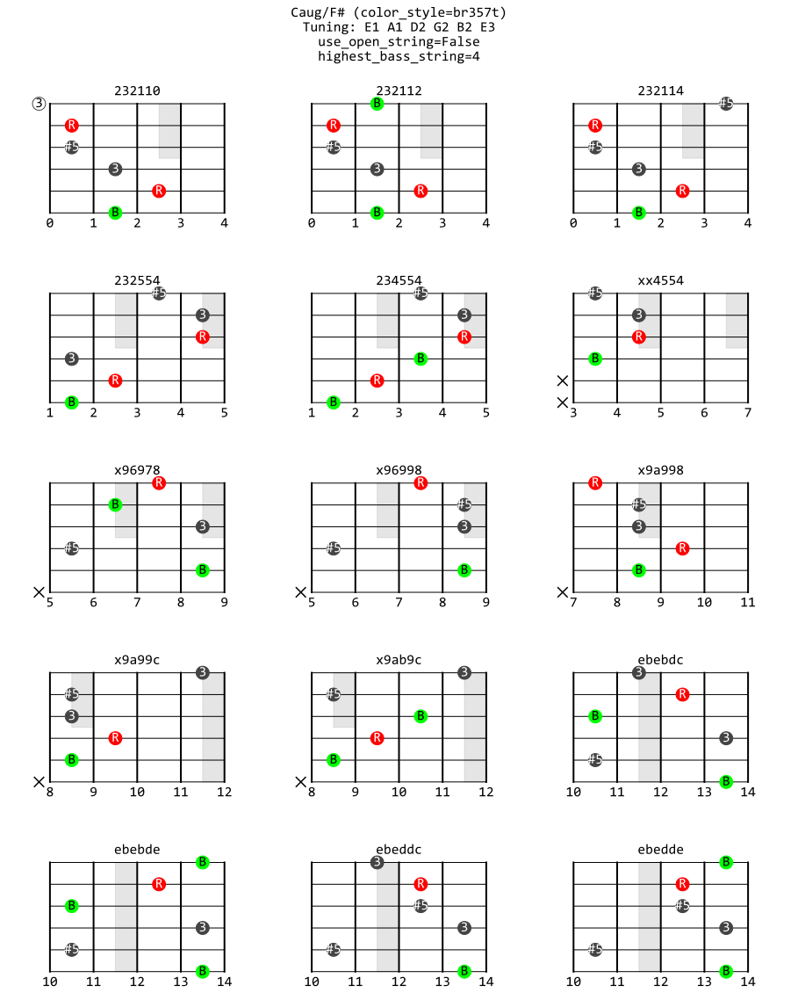

**Example. 5** 特殊调弦下列举和弦全部指法

```python
Guitar(open_string_notes=(Note('C#1'), Note('G#1'), Note('E2'), Note('F#2'), Note('B2'), Note('E3'))).add_notes(Chord('Esus2/G#')).plot_all_chords(color_style='br357t', title='Esus2/G# (color_style=br357t)')
```

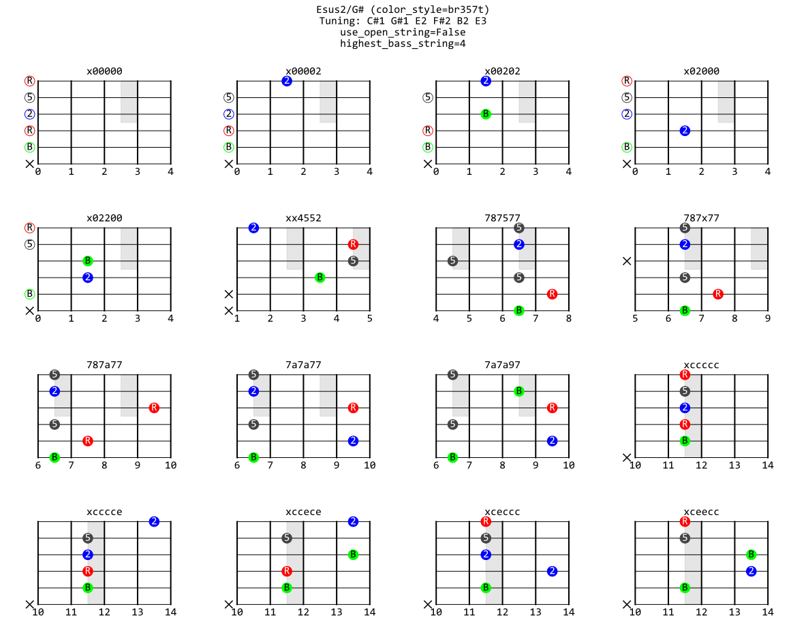

### 1.2.2 使用 `Piano` 类

**Example. 1** 绘制老式钢琴图

```python
Piano().set_notes(ChordScale('C Dorian(b4)')).plot_old(color_style='avoid')
```

_avoid.svg)

**Example. 2** 绘制新式钢琴图（支持任意平均律）

```python
Piano().set_notes(ChordScale('C Mixolydian(b2)')).plot(color_style='avoid')
```

_avoid.svg)

### 1.2.3 使用 `Clock` 类

**Example. 1** 绘制钟表图

```python
Clock().set_notes(AlteredDiatonicScale('D Lydian(b7)')).plot(color_style='degree', interval_anno_style='interval', title='D Lydian(b7)', subtitle='color_style=degree')
```

_degree.svg)

### 1.2.4 使用 `ColorScheme` 类

**Example. 1** 生成配色方案

```python
ColorScheme().set_notes(Chord('Daug')).plot(n_gradients=5, title='Daug (Triadic Color Scheme)')
```

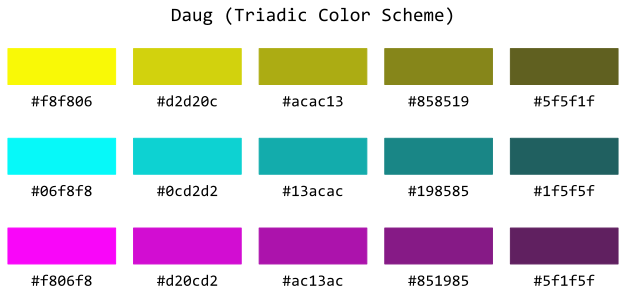

### 1.2.5 使用 `GenLine` 类

**Example. 1** 绘制久石让《One Summer Day》前四个和弦

```python
GenLine([Chord('FM7(9)').set_printoptions(ns=1), Chord('Em7(b13)').set_printoptions(ns=1), Chord('Dm7(b13)').set_printoptions(ns=1), Chord('C# R.4.b7.b3.b6.b2')]).plot(color_style='br357t', key_note=Note('C'), tds_on=True, title='One Summer Day Chords (color_style=br357t)')
```

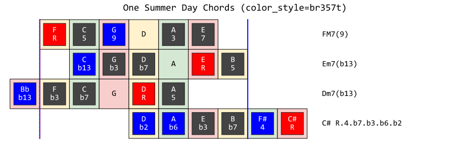

### 1.2.6 使用 `Tonnetz` 类

**Example. 1** 绘制调性网格

```python
Tonnetz().set_notes(Chord('Cm7')).plot(color_style='br357t', title='Cm7 (color_style=br357t)')
```

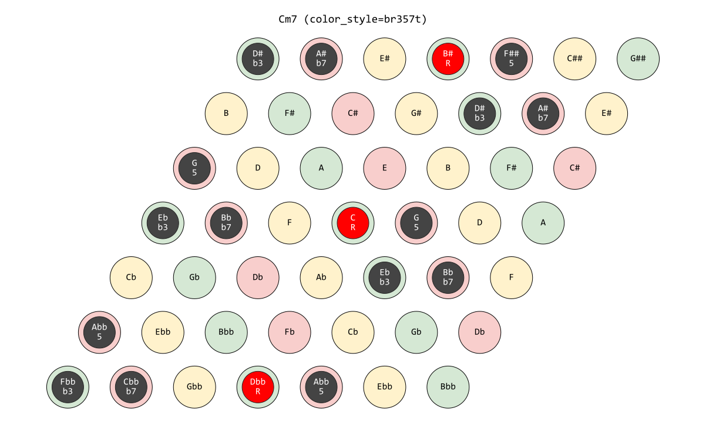

## 1.3 修改 `consts.py` 文件

### 1.3.0 其他 `NGS` 下音程命名方式的变化

当 `[N, G, S] = [12, 7, 5]` 时，生成序列为 `[5, 0, 7, 2, 9, 4, 11]`。对他们重新排列得到自然音阶 `[0, 2, 4, 5, 7, 9, 11]`。为它们赋予名称 `'CDEFGAB'`。

观察所有可能的音程：当度数差固定时，音程只有两种。比如说二度，`0 - 2`，`2 - 4` 这种二度相差 2 个半音；`4 - 5`，`11 - 0` 这种二度相差 1 个半音。再比如说 `0 - 5` 这种四度相差 5 个半音；而 `5 - 11` 这种四度相差 6 个半音，除此之外没有别的种类的四度。

事实上，**当度数差固定时，音程只有两种**这一性质可以扩展到任意平均律的 Diatonic 音阶中。那么一个很自然的想法就是，**把相同度数差中半音数相差较多的音程称作大音程，而把半音数相差较少的音程称作小音程**。

当 `S = 0` 时，自然音阶中所有的音到 `0` 音均为大音程（注意 Lydian 调式中到调式主音全为大音程）。

当 `S != 0` 时，自然音阶中所有的音到 `0` 音音程有大有小，甚至可以全为小（注意 Locrian 调式中到调式主音全为小音程）。

但是为了与传统音乐理论术语兼容，本程序特意为 `[N, G, S] = [12, 7, 5]` 设定了一套灵活的的音程表示法：

1. 当 `ns=1` 时，采用“纯增减（PAd）表示法”；当 `ns=2` 时，采用“大小增减（MmAd）表示法”。在几度音程上使用 `ns=1` 几度音程上使用 `ns=2` 被储存在 `consts.py` 的列表 `DELTA_STEP_TO_NS['12.7.5']` 中。实际上这个列表为 `[1, 2, 2, 1, 1, 2, 2]`，翻译为传统音乐理论术语就是“一四五八无大小，二三六七没有纯（from 李重光基本乐理）”。修改这个列表，可以为其他 `NGS` 下的音程自定义音程种类名称
2. 自然音阶中，到主音的音程只能为大音程或纯音程。这意味着**即使某个度数上的音程是 Diatonic 音阶中两个音程中较小的那个，也必须被命名为大音程或纯音程，此时较大的那个音程则为增音程**

传统音乐理论中音程的名称虽然并不具有数学上的简洁性，但是也有其存在的道理。纯音程（Perfect）这个术语最早起源于古希腊时期，它暗示了两音的同时发出时音响效果的协和性。而且，十二平均律中的纯音程也仅仅是更加久远的音律中的音程（如五度相生律）的一种逼近。因此这些名称依旧有其存在的道理。

### 1.3.1 使用 19 平均律

`consts.py` 定义了平均律和 Diatonic 音阶有关的各种常量。它的开头部分如下：

```python
# most basic constants (generate named nnrels from starting point `S` using step length `G` modulo `N`)
N = 12  # int(input('N: '))  # `N`-tone equal temperament (`N`-TET)
G = 7   # int(input('G: '))  # generator (step length)
S = 5   # int(input('S: '))  # starter (starting point)

# most basic calculations
M = pow(G, -1, N)                            # number of tones in diatonic scale
T = 2 ** (1 / N)                             # ratio of semi-tone frequencies
C3 = 440 * (T ** (36 - 45))                  # frequency of C3
NGS = '.'.join([str(k) for k in [N, G, S]])  # NGS for dict indexing

# define named notes (natural notes) in linear order
NAMED_STR_LIN = [
    'CDEFGAB',                                              # [12, 7, 5] and [19, 11, 8]
    'CDEXGAB',                                              # [12, 7, 0] and [19, 11, 0] (X is F#)
    'CDEGA',                                                # [12, 5, 4]
    'ABCDEFGHIJ',                                           # [23, 7, 0]
    str().join([chr(ord('A')+j) for j in range(M)]),        # 97-TET 26-tone
    str().join([chr(int('03B1', 16)+j) for j in range(M)])  # `N`-TET `M`-tone
][0]
if len(NAMED_STR_LIN) != M: raise ValueError('Number of symbols must equal to number of notes!')
```

假设现在我们想使用 19 平均律。则上述文件应在如下几行进行修改：

```python
# most basic constants (generate named nnrels from starting point `S` using step length `G` modulo `N`)
N = 19  # int(input('N: '))  # `N`-tone equal temperament (`N`-TET)
G = 11  # int(input('G: '))  # generator (step length)
S = 8   # int(input('S: '))  # starter (starting point)
```

`N = 19` 对应了 19 平均律；`G = 11` 对应了生成步长 11 个半音；`S = 8` 对应了起始音。这些音依旧被命名为 `'CDEFGAB'`。

这时整个 diatonic-tools 系统都会适配到 19 平均律上：

**Example. 1** 19 平均律下的 Diatonic 音阶

```python
>>> print(DiatonicScale('C Ionian'))
[C, D, E, F, G, A, B]
>>> DiatonicScale('C Ionian').get_nnabs_list()  # no longer [0, 2, 4, 5, 7, 9, 11]
[0, 3, 6, 8, 11, 14, 17]
```

**Example. 2** 绘制 19 平均律键盘图

```python
Piano(Piano().set_notes(DiatonicScale('C Ionian')).plot(title='C Ionian (19-TET)'))
```

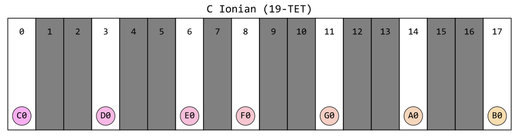

### 1.3.2 增加已命名音阶/和弦种类

直接读代码照葫芦画瓢就可以理解，这里略过。