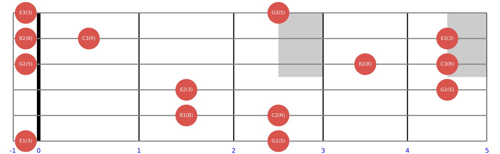
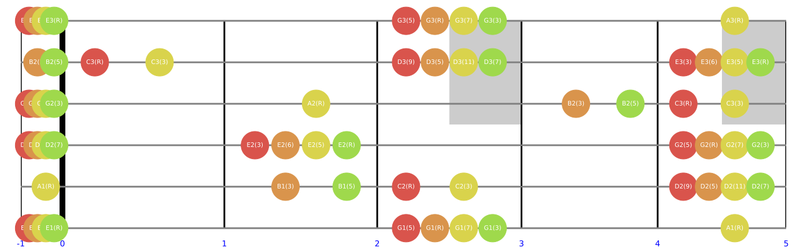
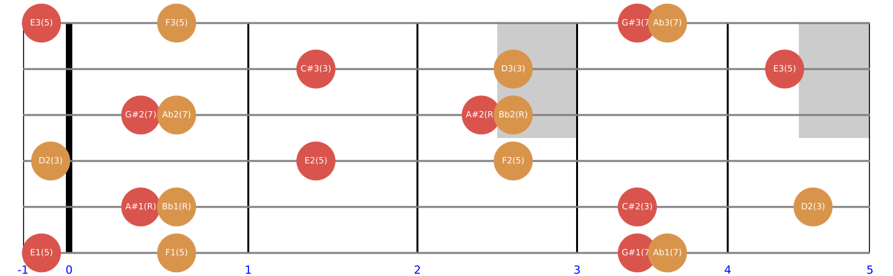
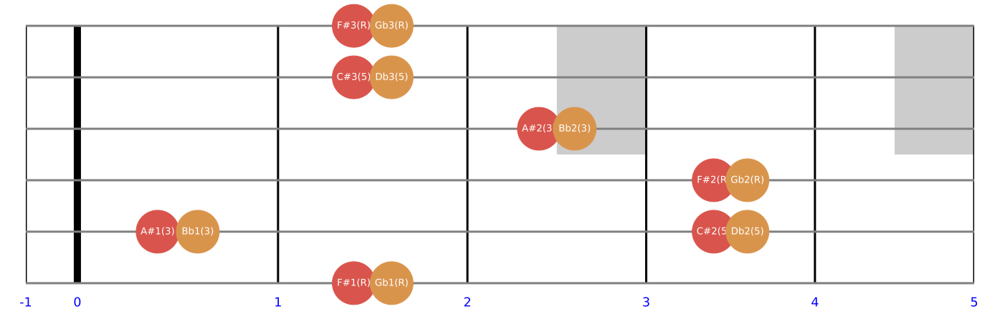

## 使用说明

一个十分简单的吉他和弦矢量图绘制程序，基于音乐理论计算。

#### 绘制吉他和弦矢量图

1. 安装 python 3.7+

2. 进入 cmd，更新 pip（这一步可以省略）

   ```python
   python -m pip install --upgrade pip
   ```

3. 安装 `matplotlib`, `numpy`

   ```python
   pip install matplotlib numpy -i https://pypi.tuna.tsinghua.edu.cn/simple
   ```

4. 在 chords.txt 中输入和弦名称，**每个和弦占一行或用空格分隔**，保存

   ```
   范例：Cm7-5, Dm7(9, 11, 13)/A, etc.
   ```

5. 运行 run.bat，内有参数可自行配置（如更改显示区间）

6. 输出 .svg 文件在 output 目录下

#### 音乐理论计算

需要使用 `theories.py` 中的 `Note`，`Interval`，`Mode` 还有 `Chord` 类。

```python
from theories import *
```

1. 计算两个音符的音程差

   ```python
   >>> print(Note('G1') - Note('C1'))
   P5
   >>> print(Note('D2') - Note('G2'))
   -P4
   >>> print(Note('G#2') - Note('C1'))
   A12
   >>> print(Note('A') - Note('C'))
   M6
   ```

2. 计算两个音程的和与差

   ```python
   >>> print(Interval('m3') + Interval('M3'))
   P5
   >>> print(Interval('d4') + Interval('A5'))
   P8
   >>> print(Interval('A12') - Interval('A4'))
   M9
   >>> print(Interval('m2') - Interval('M3'))
   -A2
   ```

3. 计算音符与音程的和差

   ```python
   >>> print(Note('G#1') + Interval('M3'))
   B#1
   >>> print(Note('G#1') + Interval('m7'))
   F#2
   >>> print(Note('Eb1') - Interval('m2'))
   D1
   >>> print(Note('C##1') - Interval('-P8'))
   C##2
   ```

4. 手动生成一个属七和弦

   ```python
   >>> M3 = Interval('M3')
   >>> P5 = Interval('P5')
   >>> m7 = Interval('m7')
   >>> print([root, root+M3, root+P5, root+m7])
   [C1, E1, G1, Bb1]
   ```

5. 手动生成 Dorian 音阶

   ```python
   >>> key = Note('C')
   >>> m2 = Interval('m2')
   >>> M2 = Interval('M2')
   >>> dorian_intervals = [M2, m2, M2, M2, M2, m2]
   >>> dorian_mode = [key]
   >>> for interval in dorian_intervals:
   ...     dorian_mode.append(dorian_mode[-1]+interval)
   >>> print(dorian_mode)
   [C0, D0, Eb0, F0, G0, A0, Bb0]
   ```

6. 使用 `Mode` 类

   ```python
   >>> print(Mode('C Dorian'))
   [C0, D0, Eb0, F0, G0, A0, Bb0, C1]
   >>> print(Mode('A1 Lydian'))
   [A1, B1, C#2, D#2, E2, F#2, G#2, A2]
   >>> print(Mode('D HMinor'))
   [D0, E0, F0, G0, A0, Bb0, C#1, D1]
   ```

7. 使用 `Chord` 类

   ```python
   >>> print(Chord('C'))
   {'root_name': 'C', 'chord_type': '', 'tension_type': None, 'bass_name': None}
   [C0, E0, G0]
   >>> print(Chord('AmM7'))
   {'root_name': 'A', 'chord_type': 'mM7', 'tension_type': None, 'bass_name': None}
   [A0, C1, E1, G#1]
   >>> print(Chord('Dm7(9, 11, 13)'))
   {'root_name': 'D', 'chord_type': 'm7', 'tension_type': '(9, 11, 13)', 'bass_name': None}
   [D0, F0, A0, C1, E1, G1, B1]
   >>> print(Chord('F#dim'))
   {'root_name': 'F#', 'chord_type': 'dim', 'tension_type': None, 'bass_name': None}
   [F#0, A0, C1]
   >>> print(Chord('A#dim7'))
   {'root_name': 'A#', 'chord_type': 'dim7', 'tension_type': None, 'bass_name': None}
   [A#0, C#1, E1, G1]
   >>> print(Chord('E7(b9)'))
   {'root_name': 'E', 'chord_type': '7', 'tension_type': '(b9)', 'bass_name': None}
   [E0, G#0, B0, D1, F1]
   >>> print(Chord('BbM7+5/C'))
   {'root_name': 'Bb', 'chord_type': 'M7+5', 'tension_type': None, 'bass_name': 'C'}
   [C-1, Bb0, D1, F#1, A1]
   ```

   
