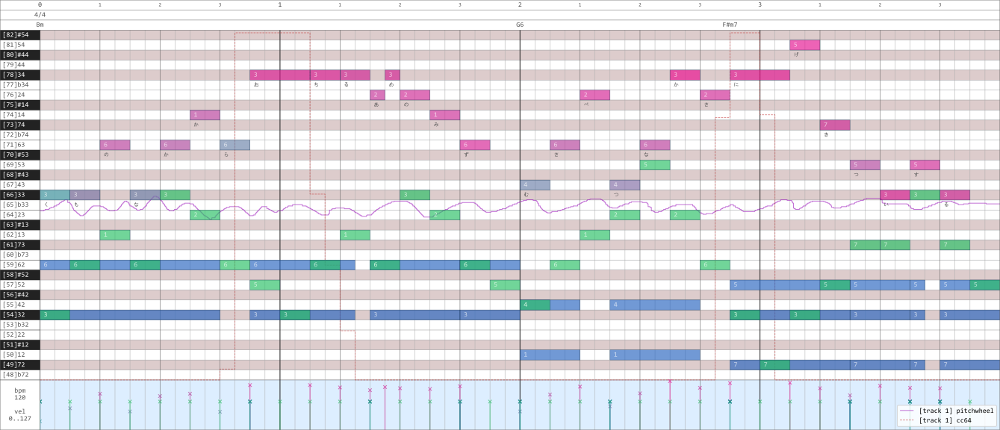
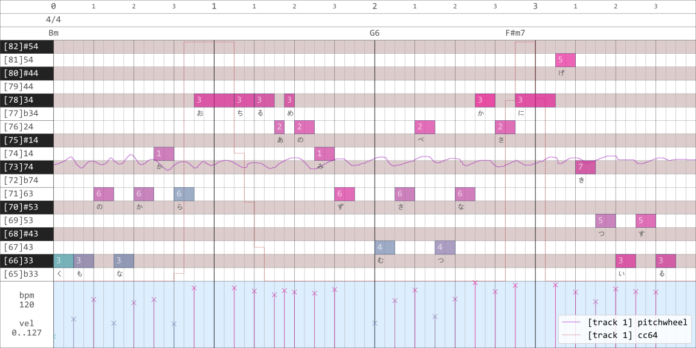

## 进度

这是 midi.py 中的 Pianoroll 类的开发进度汇总文档。

|                         功能                          | 进度 | 备注 |
| :---------------------------------------------------: | :--: | :--: |
|           某一个 channel 下 pitchwheel 显示           |  √   |      |
| 某一个 channel 下 cc 按照已使用的控制器编号分色彩显示 |  √   |      |
|     pitchwheel/cc 曲线两端没有值时自动使用默认值      |  √   |      |
|      pitchwheel/cc 曲线延伸到显示区间外面怎么办       |  √   |      |
|                   选择一个漂亮字体                    |  √   |      |
|           velocity shader / channel shader            |  √   |      |
|                  自适应钢琴键盘宽度                   |  √   |      |
|          根据四分音符长宽比自动设定图形尺寸           |  √   |      |
|                       显示歌词                        |  √   |      |
|                    xy 显示区间估计                    |  √   |      |
|                    文字的 clip box                    |  √   |      |
|                   钢琴卷帘显示鼓谱                    |  √   |      |
|              chord 显示（需要人工添加）               |  √   |      |
|                  time signature 显示                  |  √   |      |
|                    拍子线刻度显示                     |  √   |      |
|                      tempo 显示                       |  √   |      |
|                   恒定速率 bpm 显示                   |  √   |      |
|         重构 pianoroll 类，使用更加一般的方法         |  √   |      |
|                     分 track 显示                     |  √   |      |
|               选定水平区间内高度自适应                |      |      |
|                       高层 API                        |      |      |
|                      main 函数壳                      |      |      |
|                 off velocity 向下显示                 |      |      |
|           钢琴卷帘显示 ample 吉他和贝司键位           |      |      |
|                鼓谱的菱形 marker 显示                 |      |      |
|             面向用户的 tick_interval 设置             |      |      |
|            多个 track 同时显示时的 legend             |      |      |
|                  解决 channel 的问题                  |      |      |
|               使用多个 axes 拆分钢琴窗                |      |      |
|            写 sheet 到 midi 转换的接口函数            |      |      |
|          生成随机 tempo 摆动，写回 midi 文件          |      |      |
|           生成 sierpinski 三角形 midi 序列            |      |      |

## 功能

### 函数

#### matplotlib 用函数

##### `get_figure(w, h, dpi)`

说明：

用于初始化一幅图像，使 `Axes` 撑满整个 `Figure`，关闭 `Axes` 的轴显示，并使 `Axes` 内部的 `margins` 为 0。

参数：

`w`：输出图像的宽度。

`h`：输出图像的高度。

`dpi`：输出图像的分辨率。

返回：

`matplotlib.axes.Axes`：一个 matplotlib 的坐标系。

---

##### `rgb_shader(t, t_min=0, t_max=127, color1=(0.94, 0.02, 0.55), color2=(0.11, 0.78, 0.72))`

说明：

创建两个 RGB 颜色空间上的颜色的线性渐变，并取出其间某一点的颜色值。

参数：

`t`：颜色在渐变中所处的位置。

`t_min`：渐变左端位置。

`t_max`：渐变右端位置。

`color1`：渐变左端颜色（RGB）。

`color2`：渐变右端颜色（RGB）。

返回：

`list`：表示 RGB 颜色的三元组列表。

---

##### `hsv_shader(t, t_min=0, t_max=15, color1=(0.00, 0.80, 0.75), color2=(1.00, 0.80, 0.75))`

说明：

创建两个 HSV 颜色空间上的颜色的线性渐变，并取出其间某一点的颜色值。

参数：

`t`：颜色在渐变中所处的位置。

`t_min`：渐变左端位置。

`t_max`：渐变右端位置。

`color1`：渐变左端颜色（HSV）。

`color2`：渐变右端颜色（HSV）。

返回：

`list`：表示 RGB 颜色的三元组列表。

---

##### `const_shader(t, t_min=0, t_max=1, color=(1.0, 0.0, 0.0))`

说明：

创建一个 RGB 颜色空间上的常值渐变。

`t`：颜色在渐变中所处的位置。

`t_min`：任意。

`t_max`：任意。

`color`：常值颜色（RGB），取值

返回：

`list`：表示 RGB 颜色的三元组列表，等于 `color`。

#### midi/sheet 转换器

##### `track2msglist(track)`

说明：

把 `mido` 解析出的 MIDI 文件中的使用 delta time 的轨道（`track`）转换为使用 absolute time 的字典列表 `msglist`。

参数：

`track`：`mido.MidiFile.tracks[k]`

返回：

`msglist`：和 `track` 的内容相同，但 delta time 转换为了 absolute time，并且 `'type' == 'note_on'` 和 `'type' == 'note_off'` 两种 message 合并为了一个 `'type' == 'note'` 的 message，它包含键值 `type`, `time1`, `time2`, `note`, `velocity_on`, `velocity_off` 和 `channel`。 

---

##### `midi2sheet(filename)`

---

#### 类

